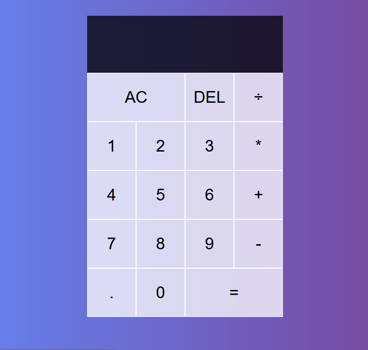

# React - calculator

# 🔗 [Live Preview]()

## About this project:

This React calculator was created as part of ongoing self-learning and skill development in front-end web development. Inspiration and help came from this video (https://youtu.be/DgRrrOt0Vr8?si=AqcgvLTJ6cw1oOSo) but frankly, it was too hard for me.

---

### Features

* Arithmetic Operations: Perform addition (+), subtraction (-), multiplication (*), and division (÷) operations.

* Clear and Delete: Use the AC button to clear the input, and the DEL button to delete the last digit.

* Real-time Display: See the current operand and the previous operand along with the selected operation.

* Error Handling: Prevents invalid operations and division by zero.

---

### Languages and features 👨‍💻 

- React: useReducer hook, functions, components, if statements and cases

Thanks for checking out my projects.

